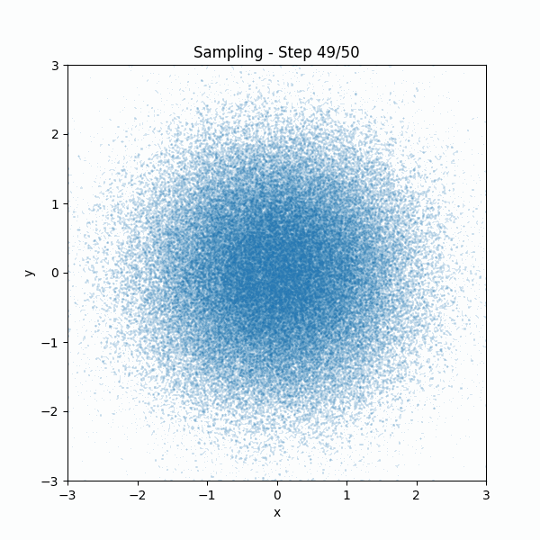

# DiffusionScratch
The Diffusion model is implemented from scratch in this repository. In this case, I used the swiss roll dataset and the algorithm basically followed **[Denoising Diffusion Probabilistic Models](https://arxiv.org/pdf/2006.11239)**.

<br></br>

## Overview
When we implement the Diffusion model, the following parts need to be implemented.
I will explain each of these steps.

- **Forward process**
- **Neural network for training**
- **Training**
- **Sampling**

You can create local environment by running following commands.

```bash
conda create -n diff python=3.11
conda activate diff
conda install pytorch torchvision pytorch-cuda=12.1 -c pytorch -c nvidia
pip install -r requirements.txt
```

<br></br>

## Forward process
The forward process of adding Gaussian noise to the input data is expressed by the following equation. Diffusion model gradually adds Guassian noise to the data according to a variance schedule $\beta_1, ..., \beta_T$.

$$
q(x_{1:T}|x_0):=\prod_{t=1}^T q(x_t|x_{t-1}), \quad q(x_t|x_{t-1}):=\mathcal{N}(x_t;\sqrt{1-\beta_t}x_{t-1},\beta_t I)
$$

A notable property of the forward process is that it admits sampling $x_t$, at an arbitrary timestep $t$ in closed form: using the notation $\alpha_t:=1-\beta_t$ and $\bar{\alpha_t}=\prod_{s=1}^t \alpha_s$, we have

$$
q(x_t|x_0) = \mathcal{N} (x_t; \sqrt{\bar{\alpha_t}}x_0, (1-\bar{\alpha_t})I)
$$

Thus, we can get $x_t$ by using a [reparameterization trick](https://sassafras13.github.io/ReparamTrick/).

$$
x_t = \sqrt{\bar{\alpha_t}}x_0 + \sqrt{1 - \bar{\alpha_t}}\epsilon \quad (\epsilon \sim \mathcal{N}(0,I))
$$

The code to get $\bar{\alpha_t}$ is here.

```python
def calculate_parameters(diffusion_steps, min_beta, max_beta):
    step = (max_beta - min_beta) / diffusion_steps
    beta_ts = torch.arange(min_beta, max_beta + step, step)

    alpha_ts = 1 - beta_ts
    bar_alpha_ts = torch.cumprod(alpha_ts, dim=0)

    return beta_ts, alpha_ts, bar_alpha_ts
```
The code to retrieve data and $\epsilon$ at any given time in the forward process is as follows.

```python
def calculate_data_at_certain_time(x_0, bar_alpha_ts, t):
    eps = torch.randn(size=x_0.shape)
    noised_x_t = (
        torch.sqrt(bar_alpha_ts[t]) * x_0 + torch.sqrt(1 - bar_alpha_ts[t]) * eps
    )

    return noised_x_t, eps
```

You can try a forward process with swiss roll by running following commands. We set the forward proces variance constants increasing linearly from $\beta_1=10^{-4}$ to $\beta_T=0.02$.

```bash
cd srcs
python3 forward_process.py
```


<br></br>

## Neural network for training
Original paper uses **U-Net** backbone, but I used simple neural network for training this time because it is enough in this data. It has 4 hidden layers and use ReLU as an activate function.  
If you want to check the architecture of model, you can run the following command.

```bash
cd srcs
python3 simple_nn.py
```

<br></br>

## Training
In reverse process, we calculate $x_{t-1}$ from $x_t$ and timestep $t$ by normal distribution.

$$
x_{t-1} \sim \mathcal{N}(\mu_\theta(x_t,t),\Sigma_t)
$$

The variance is fixed, so we need to predict $\mu_\theta(x_t,t)$. $\mu_\theta(x_t,t)$ can be rewriten as follows by simplifing equations. If you want to know the details of that, please check *derivation of loss function* section.

$$
\mu_\theta (x_t, t) = \frac{1}{\sqrt{\alpha_t}} \Big( x_t - \frac{\beta_t}{\sqrt{1-\bar{\alpha_t}}} \epsilon_\theta(x_t, t) \Big)
$$

Therefore, we train $\epsilon$ during training, loss function is as follows. If you want to know the details of that, please check *derivation of loss function* section.

$$
L_{simple} := E_{t, x_0, \epsilon} \Big[ | \epsilon - \epsilon_\theta (\sqrt{\bar{\alpha_t}}x_0 + \sqrt{1-\bar{\alpha_t}}\epsilon, t) |^2 \Big]
$$

I followed below training algorithms of original paper.


Parameters which I used during training is as follows.

```
- Optimizer -> Adam
- Batch size -> 128
- epochs -> 30
- Diffusion timesteps -> 50
- Minimum beta -> 1e-4
- Maximum beta -> 0.02
```

You can train the diffusion model by running following commands.

```bash
cd srcs
python3 train.py
```

<br></br>

## Sampling
To sample $x_{t-1} \sim p_\theta(x_{t-1}|x_t)$ is to compute below eqution. It is used [reparameterization trick](https://sassafras13.github.io/ReparamTrick/).

$$
x_{t-1} = \frac{1}{\sqrt{\alpha_t}} \Big( x_t - \frac{\beta_t}{\sqrt{1-\bar{\alpha_t}}} \epsilon_\theta(x_t, t) \Big) + \sigma_t z, \quad (z\sim \mathcal{N}(0,I))
$$


I followed below sampling algorithms of original paper. We initialize $x_T$ with a random value, and with $x_t$ and $t$ as inputs, the neural network output $\epsilon$, so we use that value to calculate $x_{t-1}$. This is repeated until $x_0$ is calculated.


You can try sampling by running following commands.

```bash
cd srcs
python3 sampling.py
```



<br></br>

## Derivation of loss function
I show the derivatino of the loss function of the diffusion model.

First, difussion model has **forward process** and the **reverse process**. In the forward process, noise is added to the input data step by step.
In the reverse process, the reverse of the forward process is performed to recover the original image from the noisy data.
The graph below is easy to understand these processes.


Diffusion model are latent variable models the form $p_\theta(x_0):=\int p_\theta(x_{0:T})dx_{1:T}$.
The joint distribution $p_\theta(x_{0:T})$ is called the reverse process,
and it is defined as a Markov chain with learned Gaussian transitions starting at $p(x_T)=\mathcal{N}(x_T;0,I)$:

$$
p_\theta(x_{0:T}) := p(x_T) \prod_{t=1}^T p_\theta(x_{t-1} \mid x_t), \quad 
p_\theta(x_{t-1} \mid x_t) := \mathcal{N}(x_{t-1}; \mu_\theta(x_t, t), \Sigma_\theta(x_t, t)) \qquad (1)
$$

Forward process is fixed to a Markov chain that gradually adds Gaussian noise to the data according to a variance schedule $\beta_1,...,\beta_T$:

$$
q(x_{1:T}|x_0):=\prod_{t=1}^T q(x_t|x_{t-1}), \quad q(x_t|x_{t-1}):=\mathcal{N}(x_t;\sqrt{1-\beta_t}x_{t-1},\beta_t I) \qquad (2)
$$

The probability the generative model assigns to the data is as follows.

$$
p_\theta(x_0)=\int dx_{1:T} p_\theta(x_{0:T}) \qquad (3)
$$

In the original paper, the integral is intractable, so the fomula transformation is shown as follows.  
Although not described in detail in the paper, I personally think that the formula transformation was performed using the forward process,
which has a known probability distribution, probably because the probability distribution of the reverse process can be complicated
and it is difficult to calculate the integral.

$$
\begin{align*}
p_\theta(x_0)&=\int dx_{1:T} p_\theta(x_{0:T}) \frac{q(x_{1:T}|x_0)}{q(x_{1:T}|x_0)} \\
&=\int dx_{1:T} q(x_{1:T}|x_0) \frac{p_\theta(x_{0:T})}{q(x_{1:T}|x_0)} \\
&=\int dx_{1:T} q(x_{1:T}|x_0) p_\theta(x_T)\prod_{t=1}^T \frac{p_\theta(x_{t-1}|x_{t})}{q(x_{t}|x_{t-1})} \qquad (4)
\end{align*}
$$

Training is performed by optimizing the usual variational bound on negative log likelihood.
Below equation has a upper bound provided by Jensen’s inequality,

$$
\begin{align*}
E[-\log p_\theta(x_0)]&=
E\Big[-\log \Big[ \int dx_{1:T} q(x_{1:T}|x_0) p(x_{T})\prod_{t=1}^T \frac{p_\theta(x_{t-1}|x_{t})}{q(x_{t}|x_{t-1})} \Big] \Big] \\
&\leq E_q\Big[-\log \Big[p(x_{T})\prod_{t=1}^T \frac{p_\theta(x_{t-1}|x_{t})}{q(x_{t}|x_{t-1})}\Big] \Big] \\
&\leq E_q\Big[-\log p(x_{T}) - \sum_{t\geq1} \log \frac{p_\theta(x_{t-1}|x_{t})}{q(x_{t}|x_{t-1})} \Big] =:L \qquad (5)
\end{align*}
$$

This equation can be further transformed as follows.

$$
\begin{align*}
L &= E_q\Big[ -\log p(x_{T}) - \sum_{t\geq1} \log \frac{p_\theta(x_{t-1}|x_{t})}{q(x_{t}|x_{t-1})} \Big] \\
&= E_q \Big[ -\log p(x_{T}) - \sum_{t>1} \log \frac{p_\theta(x_{t-1}|x_{t})}{q(x_{t}|x_{t-1})} - \log \frac{p_\theta(x_0|x_1)}{q(x_1|x_0)} \Big] \\
&= E_q \Big[ -\log p(x_{T}) - \sum_{t>1} \log \frac{p_\theta(x_{t-1}|x_{t})}{q(x_{t-1}|x_{t},x_0)} \frac{q(x_{t-1}|x_0)}{q(x_t|x_0)} - \log \frac{p_\theta(x_0|x_1)}{q(x_1|x_0)} \Big] \\
&= E_q \Big[ -\log \frac{p(x_{T})}{q(x_T|x_0)} - \sum_{t>1} \log \frac{p_\theta(x_{t-1}|x_{t})}{q(x_{t-1}|x_{t},x_0)} - \log p_\theta(x_0|x_1) \Big] \\
&= E_q \Big[ D_{KL}(q(x_T|x_0) \parallel p(x_T)) + \sum_{t>1}D_{KL}(q(x_{t-1}|x_t,x_0)\parallel p_\theta (x_{t-1}| x_t)) - \log p_\theta(x_0|x_1) \Big] \\
&= E_q \Big[ L_T + \sum_{t>1}L_{t-1} + L_0 \Big] \qquad (6)
\end{align*}
$$

In the above equation deformation, $q(x_t|x_{t-1})$ was transformed as follows.

$$
\begin{align*}
q(x_t|x_{t-1}) &= q(x_t|x_{t-1},x_0) \\
&= \frac{q(x_t,x_{t-1}|x_0)}{q(x_{t-1}|x_0)} \\
&= q(x_{t-1}|x_t,x_0) \frac{q(x_t|x_0)}{q(x_{t-1}|x_0)} \qquad (7)
\end{align*}
$$

In the course of the above equation transformation, the following relationship is used.

$$
q(x_t,x_{t-1}|x_0) = q(x_t | x_{t-1}, x_0) \cdot q(x_{t-1} | x_0) \qquad (8)
$$

I also used the following equation transformation.

$$
\begin{align*}
\sum_{t>1} \frac{q(x_{t-1}|x_0)}{q(x_t|x_0)} \frac{1}{q(x_1|x_0)}
&= \frac{\cancel{q(x_{T-1}|x_0)}...\cancel{q(x_{1}|x_0)}}{q(x_{T}|x_0)...\cancel{q(x_{2}|x_0)}} \frac{1}{\cancel{q(x_1|x_0)}} \\
&= \frac{1}{q(x_{T}|x_0)} \qquad (9)
\end{align*}
$$

$D_{KL}$ is called **KL Divergence** and is a type of statistical distance:
a measure of how one reference probability distribution $P$ is different from a second probability distribution $Q$.

$$
\begin{align*}
KL(p \parallel q) &= \int p(x) \log(q(x))dx - \Big(-\int p(x)\log p(x)dx \Big) \\
&= - \int p(x) \log \frac{q(x)}{p(x)} dx \qquad (10)
\end{align*}
$$

We will now simplify Eq(6).

### Forward process and $L_T$
We ignore the fact that the forward process variances $β_t$ are learnable by reparameterization and
instead fix them to constants. Thus, in our implementation, the approximate posterior $q$ has no learnable parameters,
**so $L_T$ is a constant during training and can be ignored.**

### Reverse process and $L_{1:T-1}$
Now we discuss our choices in $p_\theta (x_{t-1}|x_t) = \mathcal{N} (x_{t-1}:\mu_\theta(x_t, t), \Sigma_\theta(x_t, t))$ for $1 < t \leq T$.
First, we set $\Sigma_\theta(x_t, t) = \sigma_t^2 I$ to untrained time dependent constants. Experimentally, both $\sigma_t^2 = \beta_t$ and
$\sigma_t^2 = \tilde{\beta_t} = \frac{1-\bar{\alpha_{t-1}}}{1-\bar{\alpha_t}}\beta_t$ had similar results. Therefore, we can write $L_{t-1}$ as follows.

$$
L_{t-1} = E_q\Big[ \frac{1}{2\sigma_t^2} |\tilde{\mu_t}(x_t, x_0) - \mu_\theta (x_t, t) |^2 \Big] + C \qquad (11)
$$

$C$ is a constant that does not depend on $\theta$. So, we see that the most straightforward parameterization of $\mu_\theta$ is a model that predict $\tilde{\mu_t}$,
the forward process posterior mean. Thus, we can use the following equation to expand the above equation. That transformation is called as the [reparameterization trick](https://sassafras13.github.io/ReparamTrick/).

$$
x_t(x_0, \epsilon) = \sqrt{\bar{\alpha_t}} x_0 + \sqrt{1-\bar{\alpha_t}} \epsilon \quad (\epsilon \sim \mathcal{N}(0,I)) \qquad (12)
$$

We can get $x_0$ from above equation.

$$
x_0 = \frac{1}{\sqrt{\bar{\alpha_t}}}(x_t(x_0, \epsilon) - \sqrt{1 - \bar{\alpha_t}}\epsilon) \qquad (13)
$$

By using the above $x_0$, we can update $L_{t-1}$.

$$
\begin{align*}
L_{t-1} - C &= E_{x_0,\epsilon} \Big[ \frac{1}{2\sigma_t^2} \Big| \tilde{\mu_t} \Big( x_t(x_0,\epsilon), \frac{1}{\sqrt{\bar{\alpha_t}}}(x_t(x_0, \epsilon) - \sqrt{1 - \bar{\alpha_t}}\epsilon) \Big) - \mu_{\theta}(x_t(x_0, \epsilon), t) \Big|^2 \Big] \\
&= E_{x_0,\epsilon} \Big[ \frac{1}{2\sigma_t^2} \Big| \frac{1}{\sqrt{\alpha_t}} \Big( x_t(x_0,\epsilon) - \frac{\beta_t}{\sqrt{1-\bar{\alpha_t}}} \epsilon \Big) - \mu_{\theta}(x_t(x_0, \epsilon), t) \Big|^2 \Big] \qquad (14)
\end{align*}
$$

We use below $\bar{u_t}(x_t,x_0)$ for above transformation. Appendix A explains the derivation of $\bar{u_t}(x_t,x_0)$ and $\bar{\beta_t}$.

$$
q(x_{t-1}|x_t, x_0) = \mathcal{N} (x_{t-1};\tilde{\mu_t}(x_t,x_0), \tilde{\beta_t}I), \\
where \quad \tilde{\mu_t}(x_t,x_0) := \frac{\sqrt{\bar{\alpha_{t-1} \beta_t}}}{1-\bar{\alpha_{t}}} x_0 +
\frac{\sqrt{\alpha_t}(1-\bar{\alpha_{t-1}})}{1-\bar{\alpha_t}} x_t \quad and \quad \tilde{\beta_t}:=\frac{1-\bar{\alpha_{t-1}}}{1-\bar{\alpha_t}} \beta_t \qquad (15)
$$

The above equation reveals that $\mu_\theta$ must predict $\frac{1}{\sqrt{\alpha_t}}\Big( x_t - \frac{\beta_t}{\sqrt{1-\bar{\alpha_t}}}\epsilon \Big)$ given $x_t$.
Since $x_t$ is available as input to the model, we may choose the parameterization

$$
\mu_\theta (x_t, t) = \frac{1}{\sqrt{\alpha_t}} \Big( x_t - \frac{\beta_t}{\sqrt{1-\bar{\alpha_t}}} \epsilon_\theta(x_t, t) \Big) \qquad (16)
$$

where $\epsilon_\theta$ is a function approximator intended to predict $\epsilon$ from $x_t$. To sample $x_{t-1} \sim p_\theta(x_{t-1}|x_t)$ is to compute
$x_{t-1} = \frac{1}{\sqrt{\alpha_t}} \Big( x_t - \frac{\beta_t}{\sqrt{1-\bar{\alpha_t}}} \epsilon_\theta(x_t, t) \Big) + \sigma_t z$, where $z \sim \mathcal{N}(0,I)$.
In order to do this, the reparameterization trick is used.  
We can simplify the equation of $L_{t-1} - C$ by using the above equation.

$$
\begin{align*}
L_{t-1} - C &= E_{x_0,\epsilon} \Big[ \frac{1}{2\sigma_t^2} \Big| \frac{1}{\sqrt{\alpha_t}} \Big( x_t(x_0,\epsilon) - \frac{\beta_t}{\sqrt{1-\bar{\alpha_t}}} \epsilon \Big) - \mu_{\theta}(x_t(x_0, \epsilon), t) \Big|^2 \Big] \\
&= E_{x_0,\epsilon} \Big[ \frac{1}{2\sigma_t^2} \Big| \frac{1}{\sqrt{\alpha_t}} \Big( x_t(x_0,\epsilon) - \frac{\beta_t}{\sqrt{1-\bar{\alpha_t}}} \epsilon \Big) - \frac{1}{\sqrt{\alpha_t}} \Big( x_t(x_0,\epsilon) - \frac{\beta_t}{\sqrt{1-\bar{\alpha_t}}} \epsilon_\theta(x_t, t) \Big) \Big|^2 \Big] \\
&= E_{x_0,\epsilon} \Big[ \frac{\beta_t}{2\sigma_t^2 \alpha_t(1-\bar{\alpha_{t-1}})} \Big| \epsilon - \epsilon_\theta(x_t, t) \Big|^2 \Big] \\
&= E_{x_0,\epsilon} \Big[ \frac{\beta_t}{2\sigma_t^2 \alpha_t(1-\bar{\alpha_{t-1}})} \Big| \epsilon - \epsilon_\theta (\sqrt{\bar{\alpha_t}}x_0 + \sqrt{1 - \bar{\alpha_t}}\epsilon , t) \Big|^2 \Big] \qquad (17)
\end{align*}
$$

To summarize, we can train the reverse process mean function approximator $\mu_\theta$ to predict $\tilde{\mu_t}$, or by
modifying its parameterization, we can train it to predict $\epsilon$.

### Data scaling, reverse process decoder, and $L_0$
We assume that image data consists of integers in ${0, 1,..., 255}$ scaled linearly to $[−1, 1]$. This
ensures that the neural network reverse process operates on consistently scaled inputs starting from
the standard normal prior $p(x_T)$. To obtain discrete log likelihoods, we set the last term of the reverse
process to an independent discrete decoder derived from the Gaussian $\mathcal{N}(x_0; \mu_\theta(x1, 1), \sigma_1^2 I)$:

$$
\begin{align*}
p_\theta (x_0 | x_1) &= \prod_{i=1}^D \int_{\delta_{-(x_0^i)}}^{\delta_{(x_0^i)}} \mathcal{N}(x_0; \mu_\theta^i(x1, 1), \sigma_1^2 )dx \\
\delta_{+}(x) &= \begin{cases}\infty & (x = 1) \\ x + \frac{1}{255} & (x < 1) \end{cases} \quad
\delta_{-}(x) = \begin{cases}-\infty & (x = -1) \\ x - \frac{1}{255} & (x > -1) \end{cases} \qquad (18)
\end{align*}
$$

where $D$ is the data dimensionality and the $i$ superscript indicates extraction of one coordinate.
The above equation calculates the simulataneous probability of each pixel. $\delta$ means clipping bounds that
help restrict the Gaussian probability density to the range corresponding to each discrete value of $x_0^i$.
This ensures proper handling of discrete data in a continous framework.

### Simplified training objective
From Eq(17) and Eq(18), we can simplify training objective more.

$$
L_{simple} := E_{t, x_0, \epsilon} \Big[ | \epsilon - \epsilon_\theta (\sqrt{\bar{\alpha_t}}x_0 + \sqrt{1-\bar{\alpha_t}}\epsilon, t) |^2 \Big] \qquad (19)
$$

The $t = 1$ case corresponds to $L_0$ wit the integral in the discrete decoder difinition Eq(18)
approximated by the Gaussian probability density function times the bin width, ignoring $\sigma_1^2$ and edge effects.
The $t > 1$ cases correspond to an unweighted version of Eq(17).  The details are described in the paper,
but this simple formula is used because the accuracy is better when the weight portion of Eq(17) is removed.


<br></br>

## Appendix
### A. Derivation of mean and variance of $q(x_{t-1}|x_t,x_0)$
The conditional distribution $q(x_{t-1}|x_t,x_0)$ is proportional to the product of the following two distributions.

$$
q(x_{t-1}|x_t,x_0) \propto q(x_t|x_{t-1}) q(x_{t-1}|x_0)
$$

Those two distributions are defined as follows.

$$
\begin{align*}
q(x_t|x_{t-1}) &= \mathcal{N} (x_t;\sqrt{\alpha_t} x_{t-1}, \beta_t I) \\
q(x_{t-1}|x_0) &= \mathcal{N} (x_{t-1};\sqrt{\bar{\alpha_{t-1}}} x_0, (1-\bar{\alpha_{t-1}}) I)
\end{align*}
$$

When calculating variance, we use the product property of the Gaussian distribution.
The inverse of the variance in a product of Gaussian distribution is expressed as
the sum of the inverse variances of the individual distributions.

$$
\begin{align*}
\frac{1}{\tilde{\beta_t}} &= \frac{1}{\beta_t} + \frac{1}{1-\bar{\alpha_{t-1}}} \\
&= \frac{1-\bar{\alpha_{t-1}}+\beta_t}{\beta_t (1-\bar{\alpha_{t-1}})}
\end{align*}
$$

If we inverse both sides to obtain the variance $\tilde{\beta_t}$

$$
\tilde{\beta_t} = \frac{\beta_t (1-\bar{\alpha_{t-1}})}{1 - \bar{\alpha_{t-1}} + \beta_t}
$$

Here, we use the following property.

$$
1 - \bar{\alpha_{t}} = (1 - \bar{\alpha_{t-1}}) + \beta_t
$$

Substitute this into the variance fomula to transforme it.

$$
\tilde{\beta_t} = \frac{(1-\bar{\alpha_{t-1}})}{1-\bar{\alpha_t}}\beta_t
$$

Next, we consider the derivation of the mean. Letting $m_1$ and $m_2$ be the mean of each distribution
and $\sigma_1^2$ and $\sigma_2^2$ be the variance of each distribution, the mean can be calculated as follows.

$$
\tilde{\mu_t} = \frac{m_1 \sigma_2^2 + m_2 \sigma_1^2}{\sigma_1^2 + \sigma_2^2}
$$

Therefore, we can calculate the mean as follows.

$$
\begin{align*}
\tilde{\mu_t} &= \frac{(\sqrt{\alpha_t} x_{t-1})(1 - \tilde{\alpha_{t-1}}) + (\sqrt{\bar{\alpha_{t-1}}} x_0)\beta_t}{\beta_t + (1 - \tilde{\alpha_{t-1}})} \\
&= \frac{\sqrt{\alpha_{t}}(1-\tilde{\alpha_{t-1}})}{\beta_t + (1 - \tilde{\alpha_{t-1}})} x_{t-1} +
\frac{\sqrt{\tilde{\alpha_{t-1}}}\beta_t}{\beta_t + (1 - \tilde{\alpha_{t-1}})} x_0 \\
&= \frac{\sqrt{\alpha_{t-1}}\beta_t}{1 - \tilde{\alpha_{t}}}x_0 + \frac{\sqrt{\alpha_{t}}(1-\tilde{\alpha_{t-1}})}{1 - \tilde{\alpha_{t}}}x_t
\end{align*}
$$

Here, we use the following property again.

$$
1 - \bar{\alpha_{t}} = (1 - \bar{\alpha_{t-1}}) + \beta_t
$$

Honestly, I'm not sure if this derivation is correct. I also don't know why $x_{t-1}$ can be converted to $x_t$.
This may be related to the fact that we first approximate $q(x_{t-1}|x_t,x_0)$ with two probability distributions.

<br></br>

## References
- [Denoising Diffusion Probabilistic Models](https://arxiv.org/pdf/2006.11239)
- [Deep Unsupervised Learning using Nonequilibrium Thermodynamics](https://arxiv.org/pdf/1503.03585)
- [The Reparameterization Trick](https://sassafras13.github.io/ReparamTrick/)
- [toy-diffusion](https://github.com/albarji/toy-diffusion)
- [Understanding the Diffusion Model](https://data-analytics.fun/2022/02/03/understanding-diffusion-model/)
